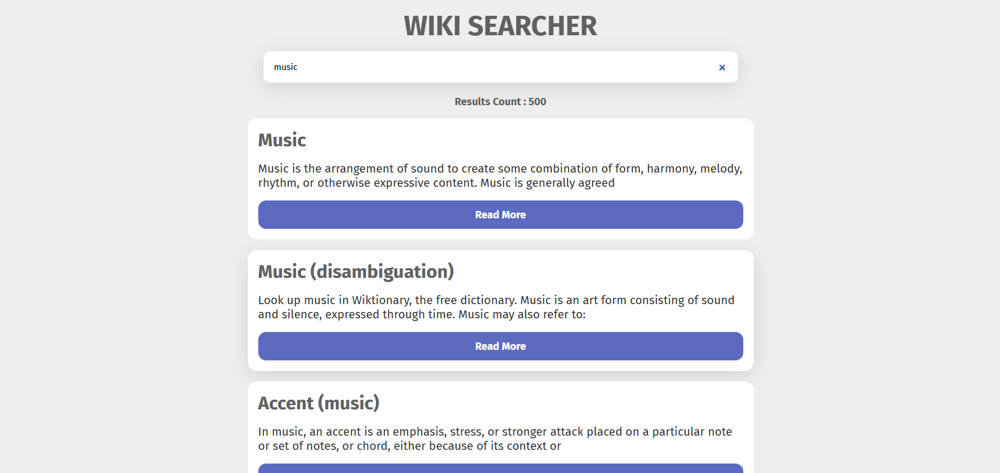

# wikipedia-api-js

- [Demo Link](https://alinikfarjam79.github.io/wikipedia-api-js/)
- **Developed by**: Ali nikfarjam
- **Created**: 2025-21-02
- **Technologies Used**: HTML, CSS, TailwindCSS, JavaScript
- **Role**: Frontend

- 

- 

